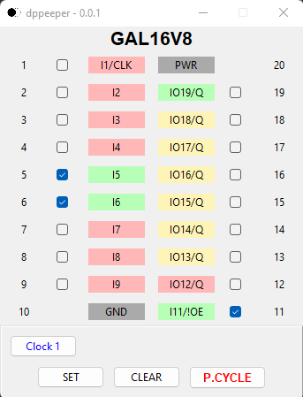

# dppeeper

## DISCLAIMER

Any use of this project is **under your own responsibility**.

Please, **do not come to me asking for hand-holding** using or building this: my time is limited.

## Introduction

This is a tool to interface your computer with the DuPAL V3 ("dupico") board and visually analyze the behaviour of a PLD IC.

It takes a description of the PLD to interface with in TOML format and shows the current state of the pins on a graphical interface.



## Command line

```
usage: dppeeper [-h] [-v] [--version] -d definition file [--skip_note] [--check_hiz]
                [--skip_hiz pin_to_skip [pin_to_skip ...]]
                {sim,dupico} ...

A tool for interactive analysis of PLDs

positional arguments:
  {sim,dupico}          supported subcommands
    sim                 Read data from a recorded file
    dupico              Read data the dupico board

options:
  -h, --help            show this help message and exit
  -v, --verbose
  --version             show program's version number and exit
  -d definition file, --definition definition file
                        Path to the file containing the definition of the IC to be read
  --skip_note           If present, skip printing adapter notes and associated delays

  --check_hiz           Check if output pins are Hi-Z or not.
  --skip_hiz pin_to_skip [pin_to_skip ...]
                        List of output pins for which the Hi-Z check is skipped
```

This tool supports two commands:

- `sim`: currently not implemented, but will be used to simulate the connection to a board using a dump of the states of a PLD
- `dupico`: connects directly to the dupico to analyze a PLD

## PLD definition format

The PLD definitions must be provided in TOML format and are structured as follows:

### Files sections

#### Root Section
- `name`: A string containing the name for this PLD

#### Pinout section \[pinout\]
- `pins_per_side`: array of integers that define both the number of sides for the IC (length of the array, 1, 2 or 4 are supported), and the number of pins per side
- `ZIF_map`: array of integers, with one entry for each pin of the IC, describing how the pins are mapped to the ZIF42 of the dupico. If a pin is mapped to 21, it corresponds to a GND, to 42, it corresponds to a generic power supply.
- `clk_pins`: array of integers that indicates which pins of the PLD can be used as clock inputs.
- `in_pins`: array of integers that indicates which pins of the PLD can be used as inputs.
- `io_pins`: array of integers that indicates which pins of the PLD can be used as i/o pins.
- `o_pins`: array of integers that indicates which pins of the PLD are used as output pins.
- `f_pins`: array of integers that indicates which pins of the PLD can act as an internal feedback. This information is not used by dppeeper.
- `q_pins`: array of integers that indicates which pins of the PLD can act as a registered output.
- `oe_l_pins`: array of integers that indicates which pins of the PLD can act a active-low output enables
- `oe_h_pins`: array of integers that indicates which pins of the PLD can act a active-high output enables

#### Adapter section \[adapter\]
This section contains configuration for adapters plugged in the ZIF socket, that may use additional pins to toggle some functionality.

- `hi_pins`: array of integers that will specify a list of pins to keep pulled high when the adapter gets powered up, and keep in this state all the time until power down
- `notes`: Human readable string with notes regarding the adapter. Might be used to print messages to the user in the future.

#### Requirements section \[requirements\]
To future proof for future hardware revisions, this section specifies which version of the adapter is necessary to read the defined IC. For now, only one field is supported.

- `hardware`: integer specifying the model number that the dpdumper will check before trying to read anything. Currently it's `3`.
